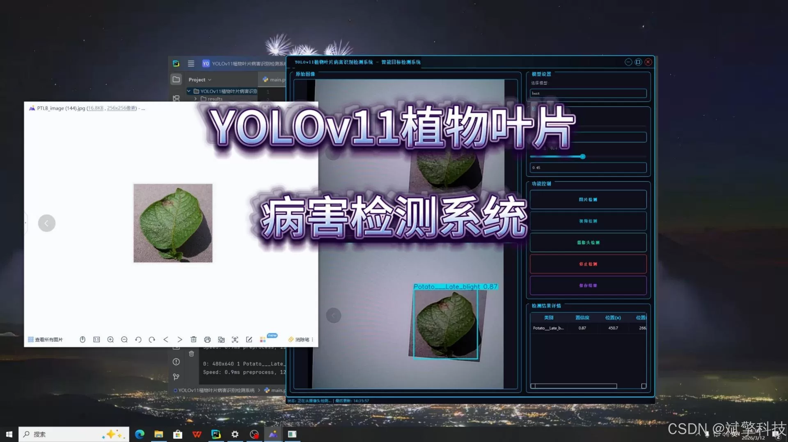
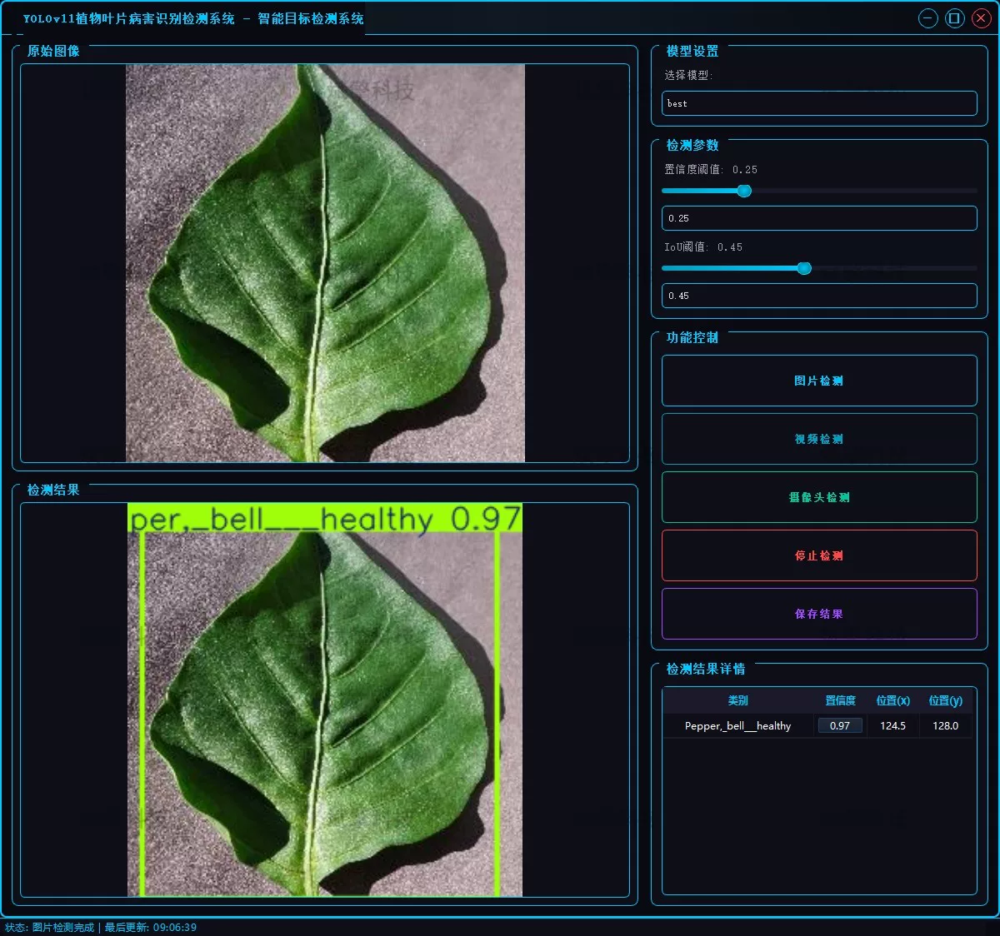
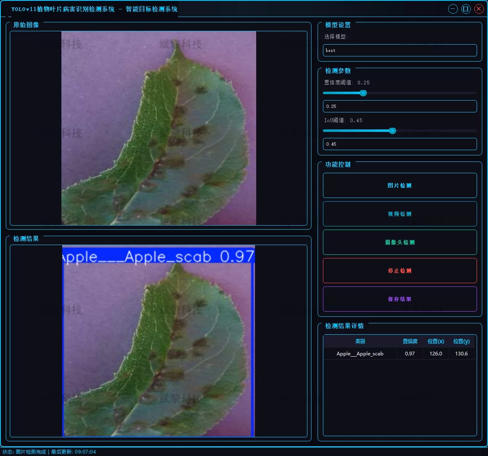

# YOLOv11 Plant Disease Detection System

## Body

YOLOv11 Plant Disease Detection System Based on YOLOv11 Deep Learning for Plant Leaf Disease Detection (YOLOv11+YOLO dataset + UI interface + login and registration interface + Python project source code + model)

The purpose of this project is to develop a plant leaf disease intelligent recognition detection system based on the YOLOv11 deep learning algorithm. This system addresses the practical pain points in agricultural production by utilizing computer vision technology to achieve rapid, accurate detection and classification of plant leaf diseases. The system is comprehensive in functionality, supporting image detection, video detection, as well as real-time camera detection (on-site monitoring), greatly expanding its application scenarios. Agricultural pest control stations can monitor through real-time cameras or researchers analyze historical data offline, both of which can provide efficient technical support with this system. By integrating advanced AI technology with agricultural pest control, this project aims to reduce the technical barriers for agricultural producers, providing strong decision support for early warning and precise prevention of crop diseases and pests, contributing to the development of smart agriculture.

Project Functionality Display

✅ User Login and Registration: Supports password verification and security validation.

✅ Three Detection Modes: Based on the YOLOv11 model, supports image, video, and real-time camera detection, accurately identifying targets.

✅ Dual-Screen Comparison: Displays original images and detection results on the same screen.

✅ Data Visualization: Real-time table displaying the category, confidence, and coordinates of detected targets.

✅ Intelligent Parameter Tuning: Offers a confidence slide bar to dynamically optimize detection accuracy, adapting to different scene needs.

✅ Sci-Fi Interactive Interface: Dark theme combined with dynamic light effects, reducing visual fatigue and improving operational experience.

✅ Multi-Thread High-Performance Architecture: Independent detection threads ensure smooth operation, real-time status prompts, and fast response without lag.

Dataset Introduction

The total number of high-quality plant leaf image datasets is 54,293.

## Images

## Payment

Here is a pay link on Stripe ( https://buy.stripe.com/3cs8yP7sY87d0vu9AB ). Please contact me lonlonago@foxmail.com after funding $89, and I will send you a complete data files , thank you!

